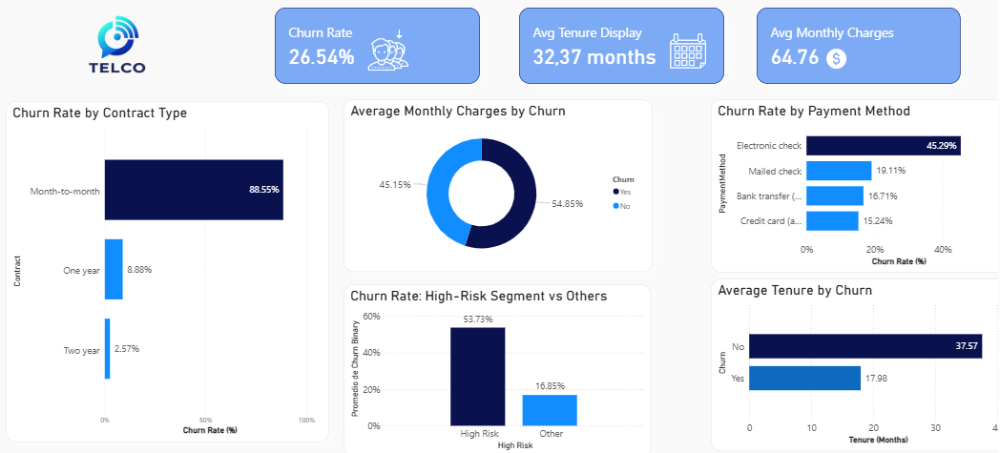

# telco-churn-analysis 
# 📊 Customer Churn Analysis | Telco Dataset

## 🎯 Project Overview

Este proyecto analiza el comportamiento de cancelación de clientes en una empresa de telecomunicaciones, identificando factores clave como tipo de contrato y método de pago.

El enfoque está en traducir datos en decisiones de negocio.

---

## 🧠 Problem Statement

Las empresas de telecomunicaciones enfrentan altos niveles de cancelación de clientes, lo que impacta directamente sus ingresos.

---

## 📈 Key Findings

- Los clientes que cancelan pagan más en promedio
- El método de pago más utilizado (electronic check) es también el que presenta mayor cancelación
- Los contratos mensuales concentran la mayor parte del churn
- Existe un segmento de alto riesgo con más del 50% de cancelación

---

## 📊 Dashboard

---

## ⚙️ Tools Used

- Python (Pandas, Matplotlib, seaborn)
- Power BI
- Jupyter Notebook

---

## 🚀 Business Recommendations

- Incentivar pagos automáticos
- Promover contratos de mayor duración
- Enfocar estrategias en clientes de alto riesgo

---

## 💡 Final Insight

La cancelación no es un problema de precio.

Es un problema de comportamiento.

👉 Lo que atrae al cliente no siempre es lo que lo retiene.
